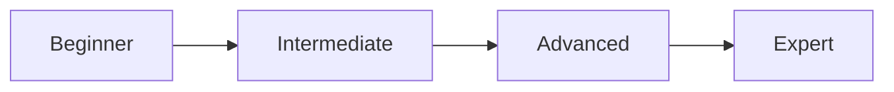

# Quản lý truy cập vào dịch vụ EC2 Resource Tag với AWS IAM 


## 📑 Mục Lục

- [Giới thiệu](#giới-thiệu)
- [Kiến trúc](#kiến-trúc)
- [Yêu cầu](#yêu-cầu)
- [Bắt đầu nhanh](#bắt-đầu-nhanh)
- [Nội dung Workshop](#nội-dung-workshop)
- [Kiểm tra & Xác nhận](#kiểm-tra--xác-nhận)
- [Dọn dẹp tài nguyên](#dọn-dẹp-tài-nguyên)
- [Hướng phát triển](#hướng-phát-triển)
- [Troubleshooting](#troubleshooting)
- [FAQ](#faq)
- [Ước tính chi phí](#ước-tính-chi-phí)
- [Workshop liên quan](#workshop-liên-quan)
- [Đóng góp](#đóng-góp)
- [Liên hệ](#liên-hệ)

---

## 📖 Giới Thiệu

Bài thực hành này sẽ đưa chúng ta qua quá trình quản lý quyền truy cập dịch vụ EC2 với **Resource Tag** thông qua cấu hình chi tiết của các chính sách và IAM role với **quyền** cụ thể. Việc sử dụng **Resource Tag** sẽ cực kỳ hữu ích khi chúng ta mở rộng trong việc quản trị phi tập trung.

## 🏗️ Kiến Trúc

Workshop này triển khai kiến trúc AWS với các components chính:

```
┌─────────────────────────────────────────────────────────────┐
│                     AWS Cloud                                │
│  ┌──────────────┐      ┌──────────────┐      ┌───────────┐ │
│  │   Users      │─────>│  Services    │─────>│  Storage  │ │
│  └──────────────┘      └──────────────┘      └───────────┘ │
└─────────────────────────────────────────────────────────────┘
```

> **Lưu ý**: Xem chi tiết trong workshop content

## 📋 Yêu Cầu

- Tài khoản AWS (có thể sử dụng AWS Free Tier)
- Kiến thức cơ bản về AWS
- Trình duyệt web hiện đại

## 🚀 Bắt Đầu Nhanh

### Chuẩn bị

```bash
# Clone repository
git clone https://gitlab.com/awsfirstcloudjourney/000028-TagbasedPolicy.git
cd 000028-TagbasedPolicy

# Cài đặt Hugo (nếu chưa có)
# macOS
brew install hugo

# Ubuntu/Debian
sudo apt-get install hugo

# Windows
choco install hugo
```

### Chạy Workshop Locally

```bash
# Start Hugo server
hugo server -D

# Mở browser
open http://localhost:1313
```

### Làm theo Workshop

1. Đọc kỹ từng bước trong workshop
2. Thực hiện hands-on theo hướng dẫn
3. Kiểm tra kết quả sau mỗi bước
4. Dọn dẹp resources khi hoàn thành

## 📚 Nội Dung Workshop

Chi tiết nội dung xem trong workshop.

## ✅ Kiểm Tra & Xác Nhận

### Kiểm tra sau mỗi bước

```bash
# Kiểm tra resources đã tạo
aws <service> describe-<resource>

# Kiểm tra logs
aws logs tail /aws/<service>/<name> --follow

# Kiểm tra status
aws <service> get-<status>
```

### Validation Checklist

- [ ] Tất cả resources được tạo thành công
- [ ] Services hoạt động đúng như mong đợi
- [ ] Security groups và IAM policies đúng
- [ ] Monitoring và logging được enable
- [ ] Cost tracking được thiết lập

## 🧹 Dọn Dẹp Tài Nguyên

**⚠️ QUAN TRỌNG**: Luôn dọn dẹp resources sau khi hoàn thành để tránh chi phí phát sinh!

### Các bước dọn dẹp

```bash
# 1. Xóa các resources theo thứ tự ngược lại với creation
aws <service> delete-<resource> --<resource>-id <id>

# 2. Kiểm tra lại
aws <service> list-<resources>

# 3. Xóa S3 buckets (nếu có)
aws s3 rb s3://<bucket-name> --force

# 4. Xóa CloudFormation stack (nếu dùng)
aws cloudformation delete-stack --stack-name <stack-name>
```

### Cleanup Checklist

- [ ] Compute resources (EC2, Lambda, ECS, etc.)
- [ ] Databases (RDS, DynamoDB, etc.)
- [ ] Storage (S3, EBS, EFS, etc.)
- [ ] Networking (VPC, subnets, security groups, etc.)
- [ ] IAM roles và policies
- [ ] CloudWatch logs và alarms
- [ ] Billing alerts verified

## 🚀 Hướng Phát Triển

### Các Bước Tiếp Theo

Sau khi hoàn thành workshop này, bạn có thể:

- Tối ưu hóa chi phí với Reserved Instances và Savings Plans
- Triển khai High Availability và Disaster Recovery
- Implement Auto Scaling cho production workloads
- Tích hợp với CI/CD pipeline
- Monitoring và logging với CloudWatch và X-Ray

### Dịch Vụ Liên Quan

Khám phá các dịch vụ AWS có thể tích hợp:

- **Auto Scaling**: Tích hợp để mở rộng chức năng
- **Load Balancer**: Tích hợp để mở rộng chức năng
- **CloudWatch**: Tích hợp để mở rộng chức năng

### Best Practices

- Sử dụng IAM Roles thay vì hardcode credentials
- Enable detailed monitoring và logging
- Implement proper security groups và NACLs
- Regular patching và updates
- Backup và disaster recovery planning

### Lộ Trình Học Tập

#### Beginner → Intermediate
1. Hoàn thành workshop cơ bản
2. Thực hành với real-world scenarios
3. Tối ưu hóa và refactor solution

#### Intermediate → Advanced
1. Implement advanced features
2. Performance tuning và optimization
3. Security hardening
4. Production deployment

#### Advanced
1. Multi-region deployment
2. Disaster recovery planning
3. Cost optimization strategies
4. Compliance và governance

### Tài Nguyên Học Tập

- [AWS Documentation](https://docs.aws.amazon.com/)
- [AWS Well-Architected Framework](https://aws.amazon.com/architecture/well-architected/)
- [AWS Workshops](https://workshops.aws/)
- [AWS Skill Builder](https://skillbuilder.aws/)
- [AWS Blog](https://aws.amazon.com/blogs/)

### Chứng Chỉ Liên Quan

- AWS Certified Solutions Architect - Associate
- AWS Certified Developer - Associate
- AWS Certified Solutions Architect - Professional

### Community & Support

- [AWS First Cloud Journey Community](https://awsfirstcloudjourney.com)
- [AWS User Groups Vietnam](https://www.meetup.com/pro/aws-user-groups-vietnam/)
- [AWS Support](https://aws.amazon.com/premiumsupport/)
- [Stack Overflow - AWS](https://stackoverflow.com/questions/tagged/amazon-web-services)


## 🏛️ AWS Well-Architected Framework

Workshop này được thiết kế theo [AWS Well-Architected Framework](https://aws.amazon.com/architecture/well-architected/):

### Security (Bảo mật)
- ✅ Sử dụng IAM roles và policies với least privilege
- ✅ Encryption at rest và in transit
- ✅ Network security với Security Groups và NACLs
- ✅ Audit và compliance với CloudTrail

### Reliability (Độ tin cậy)
- ✅ Multi-AZ deployment khi có thể
- ✅ Automated backups và disaster recovery
- ✅ Monitoring và alerting
- ✅ Self-healing với Auto Scaling

### Performance Efficiency (Hiệu suất)
- ✅ Chọn compute resources phù hợp
- ✅ Monitoring với CloudWatch
- ✅ Caching strategies
- ✅ Load balancing và distribution

### Cost Optimization (Tối ưu chi phí)
- ✅ Right-sizing resources
- ✅ Sử dụng Free Tier khi có thể
- ✅ Reserved Instances cho production
- ✅ Cost monitoring và budgets

### Operational Excellence (Vận hành xuất sắc)
- ✅ Infrastructure as Code (CloudFormation/CDK)
- ✅ Automated deployment pipelines
- ✅ Comprehensive logging
- ✅ Regular testing và updates

---

## 🔒 Security Best Practices

### IAM & Access Management
```bash
# Tạo IAM role với least privilege
aws iam create-role --role-name WorkshopRole \
  --assume-role-policy-document file://trust-policy.json

# Attach managed policies
aws iam attach-role-policy --role-name WorkshopRole \
  --policy-arn arn:aws:iam::aws:policy/ReadOnlyAccess
```

### Encryption
- **At Rest**: Enable encryption cho tất cả storage services
- **In Transit**: Sử dụng HTTPS/TLS cho tất cả communications
- **KMS**: Quản lý encryption keys với AWS KMS

### Network Security
```bash
# Tạo security group với inbound rules hạn chế
aws ec2 create-security-group \
  --group-name workshop-sg \
  --description "Workshop Security Group" \
  --vpc-id vpc-xxxxx

# Chỉ cho phép traffic cần thiết
aws ec2 authorize-security-group-ingress \
  --group-id sg-xxxxx \
  --protocol tcp \
  --port 443 \
  --cidr 0.0.0.0/0
```

### Compliance & Auditing
- Enable CloudTrail để audit API calls
- Sử dụng Config để track configuration changes
- Regular security assessments với Security Hub

---

## 🚀 Deployment Options

Workshop này hỗ trợ nhiều phương pháp deployment:

### Option 1: AWS Console (Manual)
Phù hợp cho learning và testing
```
1. Login to AWS Console
2. Navigate to service
3. Follow step-by-step guide
4. Verify deployment
```

### Option 2: AWS CLI
Tự động hóa deployment với scripts
```bash
# Configure AWS CLI
aws configure

# Run deployment script
./deploy.sh
```

### Option 3: CloudFormation
Infrastructure as Code cho production
```bash
# Deploy CloudFormation stack
aws cloudformation create-stack \
  --stack-name workshop-stack \
  --template-body file://template.yaml \
  --capabilities CAPABILITY_IAM

# Monitor stack creation
aws cloudformation describe-stacks \
  --stack-name workshop-stack
```

### Option 4: AWS CDK
Modern IaC với programming languages
```bash
# Install CDK
npm install -g aws-cdk

# Bootstrap CDK
cdk bootstrap

# Deploy CDK app
cdk deploy
```

---

## 📊 AWS Services Used

Workshop này sử dụng các AWS services sau:

| Service | Purpose | Documentation |
|---------|---------|---------------|
| EC2 | [Purpose based on workshop] | [AWS EC2 Docs](https://docs.aws.amazon.com/) |
| Lambda | [Purpose based on workshop] | [AWS Lambda Docs](https://docs.aws.amazon.com/) |
| ECS | [Purpose based on workshop] | [AWS ECS Docs](https://docs.aws.amazon.com/) |
| Fargate | [Purpose based on workshop] | [AWS Fargate Docs](https://docs.aws.amazon.com/) |
| Elastic Beanstalk | [Purpose based on workshop] | [AWS Elastic Beanstalk Docs](https://docs.aws.amazon.com/) |

> **Lưu ý**: Chi tiết về từng service xem trong workshop content

---

## 🧪 Testing & Validation

### Pre-deployment Testing
```bash
# Validate CloudFormation template (nếu có)
aws cloudformation validate-template \
  --template-body file://template.yaml

# Test IAM policies
aws iam simulate-principal-policy \
  --policy-source-arn arn:aws:iam::123456789012:role/WorkshopRole \
  --action-names s3:GetObject
```

### Post-deployment Validation
```bash
# Check resource status
aws <service> describe-<resource>

# Verify security groups
aws ec2 describe-security-groups --group-ids sg-xxxxx

# Test application endpoint
curl https://your-app-endpoint.com/health
```

### Integration Testing
```bash
# Run integration tests
python -m pytest tests/integration/

# Load testing (nếu cần)
aws cloudwatch put-metric-data \
  --namespace Workshop/LoadTest \
  --metric-name RequestCount \
  --value 1000
```

---

## 📈 Monitoring & Observability

### CloudWatch Metrics
```bash
# View metrics
aws cloudwatch get-metric-statistics \
  --namespace AWS/<Service> \
  --metric-name <MetricName> \
  --start-time 2024-01-01T00:00:00Z \
  --end-time 2024-01-01T23:59:59Z \
  --period 3600 \
  --statistics Average

# Create dashboard
aws cloudwatch put-dashboard \
  --dashboard-name workshop-dashboard \
  --dashboard-body file://dashboard.json
```

### CloudWatch Logs
```bash
# Query logs
aws logs filter-log-events \
  --log-group-name /aws/<service> \
  --filter-pattern "ERROR"

# Create log insights query
aws logs start-query \
  --log-group-name /aws/<service> \
  --start-time $(date -u -d '1 hour ago' +%s) \
  --end-time $(date -u +%s) \
  --query-string 'fields @timestamp, @message | filter @message like /ERROR/'
```

### X-Ray Tracing
```bash
# Get trace summaries
aws xray get-trace-summaries \
  --start-time $(date -u -d '1 hour ago' +%s) \
  --end-time $(date -u +%s)

# Analyze service graph
aws xray get-service-graph \
  --start-time $(date -u -d '1 hour ago' +%s) \
  --end-time $(date -u +%s)
```

### Alerting
```bash
# Create CloudWatch alarm
aws cloudwatch put-metric-alarm \
  --alarm-name high-cpu \
  --alarm-description "Alert when CPU > 80%" \
  --metric-name CPUUtilization \
  --namespace AWS/EC2 \
  --statistic Average \
  --period 300 \
  --threshold 80 \
  --comparison-operator GreaterThanThreshold \
  --evaluation-periods 2 \
  --alarm-actions arn:aws:sns:region:account-id:topic
```

---

## 🎓 Prerequisites (Chi tiết)

### AWS Account Requirements
- [ ] Active AWS account với billing enabled
- [ ] Root account MFA enabled
- [ ] IAM user với administrator access (cho workshop)
- [ ] AWS CLI configured với credentials

### Technical Knowledge
- [ ] Hiểu biết cơ bản về cloud computing concepts
- [ ] Kinh nghiệm với Linux/Unix command line
- [ ] Kiến thức về networking (TCP/IP, DNS, HTTP/HTTPS)
- [ ] Programming basics (cho automation scripts)

### Software Prerequisites
```bash
# AWS CLI
aws --version  # Should be v2.x

# Python (nếu cần)
python3 --version  # Should be 3.8+

# Node.js (nếu cần CDK)
node --version  # Should be 18+

# Git
git --version

# Hugo (cho workshop content)
hugo version
```

### AWS Service Limits
```bash
# Check current service quotas
aws service-quotas list-service-quotas \
  --service-code ec2

# Request quota increase nếu cần
aws service-quotas request-service-quota-increase \
  --service-code ec2 \
  --quota-code L-1216C47A \
  --desired-value 50
```

---

## 🔐 IAM Permissions Required

Minimum IAM permissions cần thiết cho workshop:

```json
{
  "Version": "2012-10-17",
  "Statement": [
    {
      "Effect": "Allow",
      "Action": [
        "cloudformation:*",
        "iam:CreateRole",
        "iam:AttachRolePolicy",
        "iam:PassRole",
        "<service>:*"
      ],
      "Resource": "*"
    }
  ]
}
```

> **⚠️ Lưu ý**: Đây là permissions cho workshop. Production cần least privilege.

---

## 📚 Additional Resources

### AWS Documentation
- [AWS Documentation Home](https://docs.aws.amazon.com/)
- [AWS Architecture Center](https://aws.amazon.com/architecture/)
- [AWS Well-Architected Framework](https://aws.amazon.com/architecture/well-architected/)
- [AWS Security Best Practices](https://aws.amazon.com/security/best-practices/)

### AWS Training & Certification
- [AWS Skill Builder](https://skillbuilder.aws/) - Free digital training
- [AWS Workshops](https://workshops.aws/) - Hands-on workshops
- [AWS Ramp-Up Guides](https://aws.amazon.com/training/ramp-up-guides/)
- [AWS Certification](https://aws.amazon.com/certification/)

### Community & Support
- [AWS re:Post](https://repost.aws/) - Community Q&A
- [AWS Forums](https://forums.aws.amazon.com/)
- [AWS User Groups](https://aws.amazon.com/developer/community/usergroups/)
- [AWS Events](https://aws.amazon.com/events/)

### Tools & SDKs
- [AWS CLI](https://aws.amazon.com/cli/)
- [AWS SDKs](https://aws.amazon.com/tools/)
- [AWS CDK](https://aws.amazon.com/cdk/)
- [AWS Copilot](https://aws.amazon.com/containers/copilot/)

---

## 🏆 Workshop Completion

### Validation Checklist
- [ ] Tất cả resources đã deploy thành công
- [ ] Security best practices đã áp dụng
- [ ] Monitoring và logging đã setup
- [ ] Testing đã pass
- [ ] Documentation đã complete
- [ ] Cleanup đã thực hiện

### Next Steps After Completion
1. ⭐ Star repository nếu hữu ích
2. 📝 Share feedback và improvements
3. 🎓 Làm workshop tiếp theo trong learning path
4. 🏅 Consider AWS certification
5. 👥 Tham gia AWS community

### Certificate
Sau khi hoàn thành workshop:
- Review tất cả concepts đã học
- Thực hành lại từng bước
- Explore advanced features
- Build projects riêng với AWS

---

## 🔧 Troubleshooting

### Lỗi Thường Gặp

#### Lỗi 1: Permission Denied
```
Error: User is not authorized to perform action
```

**Giải pháp**: Kiểm tra IAM permissions
```bash
aws iam get-user
aws iam list-attached-user-policies --user-name <username>
```

#### Lỗi 2: Resource Already Exists
```
Error: Resource already exists
```

**Giải pháp**: Kiểm tra và xóa resource cũ hoặc dùng tên khác
```bash
aws <service> describe-<resource> --<resource>-name <name>
```

#### Lỗi 3: Quota Exceeded
```
Error: You have exceeded the maximum number of resources
```

**Giải pháp**: Request quota increase hoặc xóa resources không dùng
```bash
aws service-quotas get-service-quota --service-code <code> --quota-code <code>
```

### Debug Commands

```bash
# CloudWatch Logs
aws logs tail /aws/<service> --follow

# CloudTrail Events
aws cloudtrail lookup-events --lookup-attributes AttributeKey=EventName,AttributeValue=<event>

# System Manager Session Manager
aws ssm start-session --target <instance-id>
```

### Nhận Hỗ Trợ

- [AWS Support Center](https://console.aws.amazon.com/support/)
- [AWS Forums](https://forums.aws.amazon.com/)
- [Stack Overflow - AWS Tag](https://stackoverflow.com/questions/tagged/amazon-web-services)

## ❓ FAQ

### Workshop liên quan đến chi phí không?

Một số AWS services có Free Tier. Tuy nhiên, một số resources có thể phát sinh chi phí. Xem section [Ước tính chi phí](#ước-tính-chi-phí) để biết thêm chi tiết.

### Workshop này mất bao lâu để hoàn thành?

Thời gian hoàn thành tùy thuộc vào experience level của bạn. Xem badge ở đầu README để biết estimated time.

### Tôi cần kinh nghiệm gì để làm workshop này?

Xem section [Yêu cầu](#yêu-cầu) để biết prerequisites cần thiết.

### Tôi có thể chạy workshop này nhiều lần không?

Có! Nhớ dọn dẹp resources sau mỗi lần chạy để tránh conflicts và chi phí.

### Workshop này có certificate không?

Workshop này là self-paced learning. Để nhận AWS certifications, bạn cần thi các kỳ thi chính thức của AWS.

### Tôi gặp lỗi, phải làm sao?

Xem section [Troubleshooting](#troubleshooting) hoặc liên hệ qua [Community](#community--support).

## 💰 Ước Tính Chi Phí

### AWS Free Tier

Nhiều services trong workshop có thể sử dụng AWS Free Tier:

- **EC2**: 750 hours/month t2.micro (12 tháng đầu)
- **S3**: 5GB storage, 20,000 GET, 2,000 PUT requests
- **Lambda**: 1 million requests/month, 400,000 GB-seconds
- **DynamoDB**: 25GB storage, 25 read/write capacity units

### Ước Tính Chi Phí (nếu vượt Free Tier)

| Service | Configuration | Estimated Cost/Month |
|---------|--------------|---------------------|
| Compute | Small instances | $10-50 |
| Database | Development tier | $15-30 |
| Storage | <100GB | $3-10 |
| Networking | Standard transfer | $5-15 |

> **Lưu ý**: Chi phí thực tế có thể khác nhau tùy region và usage pattern.

### Tiết Kiệm Chi Phí

1. ✅ Dọn dẹp resources ngay sau khi hoàn thành
2. ✅ Sử dụng Free Tier khi có thể
3. ✅ Set up billing alerts
4. ✅ Chọn instance size phù hợp
5. ✅ Enable cost optimization features

### Theo Dõi Chi Phí

```bash
# AWS Cost Explorer
aws ce get-cost-and-usage --time-period Start=2024-01-01,End=2024-01-31 --granularity MONTHLY --metrics BlendedCost

# Set billing alarm
aws cloudwatch put-metric-alarm --alarm-name billing-alarm --alarm-description "Billing exceeded $10" --metric-name EstimatedCharges --namespace AWS/Billing --statistic Maximum --period 21600 --evaluation-periods 1 --threshold 10 --comparison-operator GreaterThanThreshold
```

## 🔗 Workshop Liên Quan

### Security Workshops

Khám phá thêm các workshops trong cùng category:

- Xem [Workshop Index](../README_INDEX.md) để tìm workshops liên quan
- Filter by category: `Security`
- Sort by difficulty level

### Learning Path



### Workshops Đề Xuất

1. **Beginner**: Workshops 000001-000020
2. **Intermediate**: Workshops 000021-000060
3. **Advanced**: Workshops 000061-000160
4. **Expert**: Workshops 100000+

## 🤝 Đóng Góp

Nếu bạn tìm thấy lỗi hoặc muốn cải thiện workshop, vui lòng:

1. Fork repository
2. Tạo branch mới (`git checkout -b feature/improvement`)
3. Commit thay đổi (`git commit -am 'Add new feature'`)
4. Push lên branch (`git push origin feature/improvement`)
5. Tạo Pull Request

## 📞 Liên Hệ

- **Website**: [AWS First Cloud Journey](https://awsfirstcloudjourney.com)
- **GitLab**: [awsfirstcloudjourney](https://gitlab.com/awsfirstcloudjourney)
- **Email**: contact@awsfirstcloudjourney.com

---

<p align="center">
  <i>⭐ Nếu workshop này hữu ích, hãy star repository! ⭐</i>
</p>

<p align="center">
  <sub>Built with ❤️ by AWS First Cloud Journey Team</sub>
</p>
